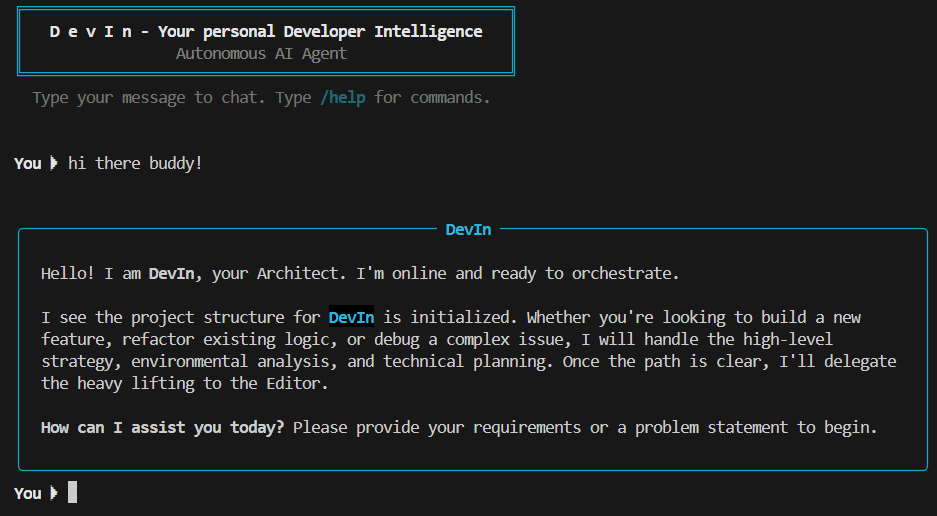
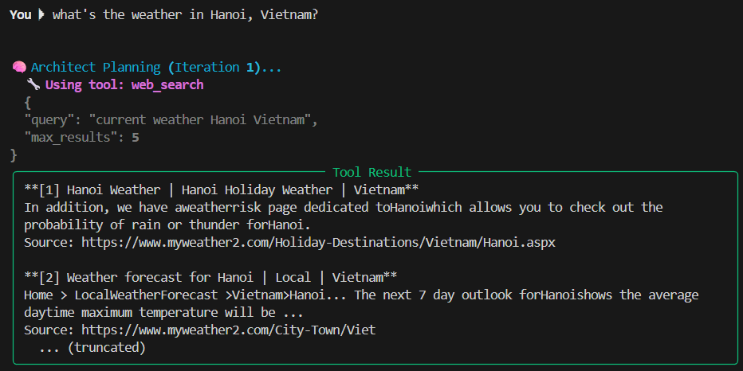

<div align="center">

# DevIn: Developer Intelligence
   

</div>

DevIn is an autonomous AI agent designed to streamline CLI and automate software development tasks. Built on a sophisticated multi-agent architecture, DevIn employs a hierarchical approach to problem-solving, featuring specialized AI agents for planning, execution, and validation.



## Key Features:

-   **Multi-Agent Architecture**:
    -   **Architect**: The strategic "brain" responsible for high-level planning, environmental exploration, and delegating detailed instructions.
    -   **Editor**: The "hands" of DevIn, executing the Architect's plans by writing code, modifying files, and running terminal commands.
    -   **Validator**: A quality assurance agent that verifies the Editor's work, providing feedback to ensure correctness and adherence to the plan.
-   **Flexible LLM Integration**: Supports multiple Large Language Model (LLM) providers, including Google Gemini (default), OpenRouter, OpenAI, and Anthropic, allowing for adaptable and powerful AI reasoning.
-   **Comprehensive Toolset**: Equipped with a range of tools for interacting with the development environment:
    -   **File System Tools**: `read_file`, `list_directory`, `write_file`
    -   **Execution Tools**: `execute_command` (for terminal operations)
    -   **Utility Tools**: `calculator` (for safe mathematical evaluations), `web_search` (for up-to-date information), `get_current_time` (for temporal awareness).
-   **Rich Command-Line Interface (CLI)**: Provides an interactive and user-friendly terminal experience with real-time feedback, streaming agent thoughts and tool calls, slash commands (e.g., `/help`, `/clear`), and conversation logging.
-   **Configurable and Secure**: Easily configured via `.env` files for API keys and settings. Incorporates safety mechanisms, such as input sanitization for the calculator and output truncation for command execution, to ensure secure and controlled operations.
-   **LangGraph Powered**: Leverages LangGraph to orchestrate the complex interactions and state management between the different AI agents, enabling a robust and iterative problem-solving cycle.

DevIn aims to enhance developer productivity by intelligently automating various coding workflows, from understanding requirements and planning solutions to executing changes and validating outcomes.



## Getting Started

### Prerequisites
- Python 3.10+
- Git installed
- Virtual environment setup

### Installation
```bash
# Clone repository
git clone https://github.com/devin-ph/DevIn.git
cd DevIn

# Create virtual environment
python -m venv .venv
source .venv/Scripts/activate

# Install dependencies
pip install -r requirements.txt

# Configure environment variables
cp .env.example .env
# Edit .env with your API keys 
```

## Contributing
Contributions are welcome! Please follow these guidelines:
1. Fork the repository
2. Create a feature branch (`git checkout -b feature/your-feature`)
3. Commit changes (`git commit -m 'Add some feature'`)
4. Push to branch (`git push origin feature/your-feature`)
5. Open a pull request

## Setup

1. Clone repo.
2. Copy `.env.example` to `.env` and add your API keys.
3. Copy `src/devin/skills/WHO_YOU_ARE.example.md` to `src/devin/skills/WHO_YOU_ARE.md` and fill in your personal profile.
4. Run: `pip install -r requirements.txt`
5. Run: `python -m devin.main`

## License                            
Distributed under the MIT License. See `LICENSE` file for details. 